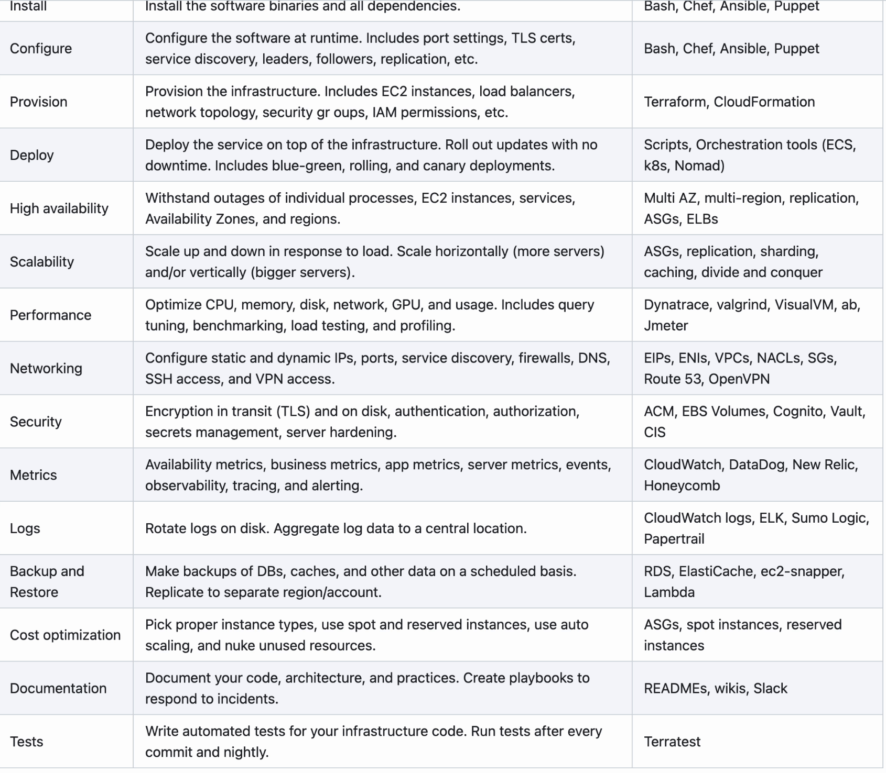

# Get Started with terragrunt-eks-vpc

Refs:
- https://github.com/gruntwork-io/terragrunt-infrastructure-live-example/tree/master
- https://github.com/gruntwork-io/terragrunt-infrastructure-modules-example/tree/master
- https://gruntwork.io/repos/v0.0.1-01172020/infrastructure-modules-acme
- https://github.com/terraform-aws-modules/terraform-aws-eks/blob/master/main.tf
- https://github.com/particuleio/teks/blob/main/terragrunt/live/production/eu-west-1/clusters/demo/eks/terragrunt.hcl

```sh
brew install tgenv

tgenv install 0.48.0
```

# Develop a single module locally
```sh
pwd 
terragrunt-eks-vpc/dev/ue1/dev/rds

# ref: https://terragrunt.gruntwork.io/docs/features/execute-terraform-commands-on-multiple-modules-at-once/#testing-multiple-modules-locally
# terragrunt plan --terragrunt-source <LOCAL_PATH_OF_MODULE>
terragrunt plan --terragrunt-source ../../../../modules/rds/

# or
TERRAGRUNT_SOURCE=LOCAL_PATH_OF_MODULE
terragrunt plan
```

# Deploy all modules in region/env
```sh
pwd
terragrunt-eks-vpc/ue1/dev

$  terragrunt graph-dependencies
digraph {
        "eks" ;
        "eks" -> "vpc";
        "vpc" ;
}

terragrunt run-all validate

# if without undeployed output dependencies among modules
terragrunt run-all plan # terragrunt plan-all is being deprecated
```

## EKS Module Design (DRY) by Gruntwork 
- https://docs.dogfood-stage.com/reference/modules/terraform-aws-eks/eks-cluster-workers/
- https://medium.com/@iangrunt/a-visual-checklist-for-writing-production-grade-terraform-modules-42f092fa7071




## VPC Module Design (DRY) by Gruntwork 
- https://docs.dogfood-stage.com/reference/services/networking/virtual-private-cloud-vpc

## RDS Module by Gruntwork
- https://gruntwork.io/repos/v0.31.4/module-data-storage/modules/rds#fromHistory


# EKS Security Best Practice
Refs:
- https://docs.aws.amazon.com/eks/latest/userguide/security-best-practices.html
- https://aws.github.io/aws-eks-best-practices/security/docs/

- Identity and Access Management
        - Don't use a service account token for authentication
        - Employ least privileged access to AWS Resources
        - Use IAM Roles when multiple users need identical access to the cluster
        - Employ least privileged access when creating RoleBindings and ClusterRoleBindings
        - Make the EKS Cluster Endpoint private
        - Create the cluster with a dedicated IAM role
        - Use tools to make changes to the aws-auth ConfigMap
        - Regularly audit access to the cluster
        - IAM Roles for Service Accounts (IRSA)
        - Update the aws-node daemonset to use IRSA
        - Restrict access to the instance profile assigned to the worker node
        - Scope the IAM Role trust policy for IRSA to the service account name
        - Disable auto-mounting of service account tokens
        - Use dedicated service accounts for each application
        - Run the application as a non-root user
        - Grant least privileged access to applications
        - Review and revoke unnecessary anonymous access
- Pod Security
        - Linux Capabilities
        - Node Authorization
        - Pod Security Standards (PSS)
        - Policy-as-code (PAC)
                - OPA/Gatekeeper
                - Open Policy Agent (OPA)
                - Kyverno
                - Kubewarden
                - jsPolicy
        - Pod Security Standards (PSS) and Pod Security Admission (PSA)
        - Do not run processes in containers as root
        - Never run Docker in Docker or mount the socket in the container
                - While this conveniently lets you to build/run images in Docker containers, you're basically relinquishing complete control of the node to the process running in the container. If you need to build container images on Kubernetes use Kaniko, buildah, or a build service like CodeBuild instead.
        - Restrict the use of hostPath or if hostPath is necessary restrict which prefixes can be used and configure the volume as read-only
        - Set requests and limits for each container to avoid resource contention and DoS attacks
        - Do not allow privileged escalation
        - Disable ServiceAccount token mounts
        - Disable service discovery
        - Configure your images with read-only root file system
- Runtime Security
        - Security contexts and built-in Kubernetes controls
        - Linux capabilities
        - Seccomp
        - AppArmor and SELinux
        - Use Amazon GuardDuty for runtime monitoring and detecting threats to your EKS environments
        - Use a 3rd party solution for runtime monitoring (e.g. falco)
        - Consider add/dropping Linux capabilities before writing seccomp policies
- Network Security
        - Network policy
                - Create a default deny policy
                - Create a rule to allow DNS queries
                - Incrementally add rules to selectively allow the flow of traffic between namespaces/pods
                - Audit Network Policies regularly
                - Ensure Network Policies exists using Open Policy Agent (OPA)
        - Monitor the vpc-network-policy-controller, node-agent logs
        - AWS VPC Flow Logs 
        - Security groups
        - Reduce the attack surface
        - reduce the blast radius
        - Encryption in transit
                - Use encryption with AWS Elastic load balancers (ACM Private CA with cert-manager)
                - Service Mesh Policy Enforcement or Kubernetes network policy
- Multi-tenancy
        - Namespaces
        - Network policies
        - Role-based access control (RBAC)
        - Quotas
        - Pod priority and preemption
        - Isolating tenant workloads to specific nodes
                - Part 1 - Node affinity
                - Part 2 - Taints and tolerations
                - Part 3 - Policy-based management for node selection
- Detective Controls
        - Enable audit logs
        - Utilize audit metadata
        - Create alarms for suspicious events
        - Analyze logs with Log Insights
        - Audit your CloudTrail logs
        - Use CloudTrail Insights to unearth suspicious activity
        - kubeaudit
        - kube-scan: Assigns a risk score to the workloads running in your cluster in accordance with the Kubernetes Common Configuration Scoring System framework
        - kubesec.io
        - polaris
        - Starboard
        - Snyk
        - Kubescape: Kubescape is an open source kubernetes security tool that scans clusters, YAML files, and Helm charts. It detects misconfigurations according to multiple frameworks (including NSA-CISA and MITRE ATT&CK®.)
- Infrastructure Security
        - Use an OS optimized for running containers
        - Keep your worker node OS updated
        - Treat your infrastructure as immutable and automate the replacement of your worker nodes
        - Periodically run kube-bench to verify compliance with CIS benchmarks for Kubernetes
        - Minimize access to worker nodes
                - Instead of enabling SSH access, use SSM Session Manager when you need to remote into a host
                - Minimal IAM policy for SSM based SSH Access
        - Deploy workers onto private subnets
        - Run Amazon Inspector to assess hosts for exposure, vulnerabilities, and deviations from best practices
        - Run SELinux
- Data Encryption and Secrets Management
        - Encrypt data at rest
        - Rotate your CMKs periodically
        - Use EFS access points to simplify access to shared datasets
        - EBS volumes for etcd nodes are encrypted with EBS encryption
        - Use AWS KMS for envelope encryption of Kubernetes secrets
        - Audit the use of Kubernetes Secrets
        - Rotate your secrets periodically
        - Use separate namespaces as a way to isolate secrets from different applications
        - Use volume mounts instead of environment variables
        - Use an external secrets provider (e.g. vault, sealed secret)
- Regulatory Compliance
- Incident Response and Forensics
        - Identify the offending Pod and worker node
        - Identify the offending Pods and worker nodes using workload name
        - Identify the offending Pods and worker nodes using service account name
        - Identify Pods with vulnerable or compromised images and worker nodes
        - Isolate the Pod by creating a Network Policy that denies all ingress and egress traffic to the pod
        - Revoke temporary security credentials assigned to the pod or worker node if necessary
        - Cordon the worker node
        - Enable termination protection on impacted worker node
        - Label the offending Pod/Node with a label indicating that it is part of an active investigation
        - Capture volatile artifacts on the worker node
                - Capture the operating system memory
                - Perform a netstat tree dump of the processes running and the open ports
                - Run commands to save container-level state before evidence is altered.
                - Pause the container for forensic capture.
                - Snapshot the instance's EBS volumes.
        - Redeploy compromised Pod or Workload Resource
        - Review the AWS Security Incident Response Whitepaper
        - Practice security game days
        - Run penetration tests against your cluster
- Image Security
        - Create minimal images
        - Use multi-stage builds
        - Create Software Bill of Materials (SBOMs) for your container image
        - Scan images for vulnerabilities regularly
                - Grype
                - Palo Alto - Prisma Cloud (twistcli)
                - Aqua
                - Kubei
                - Trivy
                - Snyk
        - Use attestations to validate artifact integrity
        - Create IAM policies for ECR repositories
        - Consider using ECR private endpoints
        - Implement endpoint policies for ECR
        - Implement lifecycle policies for ECR
        - Create a set of curated images
        - Add the USER directive to your Dockerfiles to run as a non-root user
        - Lint your Dockerfiles
        - Build images from Scratch
        - Use immutable tags with ECR
        - Sign your images, SBOMs, pipeline runs and vulnerability reports
        - Image integrity verification using Kubernetes admission controller
        - Update the packages in your container images


## Linting & Git Pre Commit Hooks using Husky
Ref: https://www.npmjs.com/package/husky

```sh
brew install npm
npm install husky --save-dev

npm pkg set scripts.prepare="husky install"
npm run prepare

touch .husky/pre-commit
```

Edit .husky/pre-commit file for linting and running tests 
```sh
. "$(dirname -- "$0")/_/husky.sh"

# run terraform fmt
terraform fmt --recursive
terraform validate

# run terragrunt fmt
terragrunt hclfmt

# run other smoke or acceptance tests etc
```

## Monorepo vs. polyrepo

This repo is an example of a *monorepo*, where you have multiple modules in a single repository. There are benefits and drawbacks to using a monorepo vs. using a *polyrepo* - one module per repository. Which you choose depends on your tooling, how you build/test Terraform modules, and so on. Regardless, the [live repo](https://github.com/gruntwork-io/terragrunt-infrastructure-live-example) will consume the modules in the same way: a reference to a Git release tag in a `terragrunt.hcl` file.

### Advantages of a monorepo for Terraform modules

* **Easier to make global changes across the entire codebase.** For example, applying a critical security fix or upgrading everything to a new version of Terraform can happen in one logical commit.
* **Easier to search across the entire codebase.** You can search through all the module code using a standard text editor or file searching utility just with one repo checked out.
* **Simpler continuous integration across modules.** All your code is tested and versioned together. This reduces the chance of _late integration_ issues arising from out-of-date module-dependencies.
* **Single repo and build pipeline to manage.** Permissions, pull requests, etc. all happen in one spot. Everything validates and tests together so you can see any failures in one spot.

### Disadvantages of a monorepo for Terraform modules

* **Harder to keep changes isolated.** While you're modifying module `foo`, you also have to think through whether this will affect module `bar`.
* **Ever increasing testing time.** The simple approach is to run all tests after every commit, but as the monorepo grows, this gets slower and slower (and more brittle).
* **No dependency management system.** To only run a subset of the tests or otherwise validate only changed modules, you need a way to tell which modules were affected by which commits. Unfortunately, Terraform has no first-class dependency management system, so there's no way to know that a code change in a file in module `foo` won't affect module `bar`. You have to build custom tooling that figures this out based on heuristics (brittle) or try to integrate Terraform with dependency management / monorepo tooling like [bazel](https://bazel.build/) (lots of work).
* **Doesn't work with the Terraform Private Registry.** Private registries (part of Terraform Enterprise and Terraform Cloud) require one module per repo.
* **No feature toggle support.** Terraform doesn't support feature toggles, which are often critical for making large scale changes in a monorepo.
* **Release versions change even if module code didn't change.** A new "release" of a monorepo involves tagging the repo with a new version. Even if only one module changed, all the modules effectively get a new version.

### Advantages of one-repo-per-module

* **Easier to keep changes isolated.** You mostly only have to think about the one module/repo you're changing rather than how it affects other modules.
* **Works with the Terraform Private Registry.** Private registries (part of Terraform Enterprise and Terraform Cloud) can list modules in a one-repo-per-module format if you [follow their module structure](https://www.terraform.io/docs/modules/index.html#standard-module-structure) and [repository naming conventions](https://www.terraform.io/docs/registry/modules/publish.html#requirements).
* **Testing is faster and isolated.** When you run tests, it's just tests for this one module, so no extra tooling is necessary to keep tests fast.
* **Easier to detect individual module changes.** With only one module in a repo, there's no guessing at which module changed as releases are published.

### Disdvantages of one-repo-per-module

* **Harder to make global changes.** Changes across repos require lots of checkouts, separate commits and pull requests, and an updated release per module. This may need to be done in a specific order based on depedency graphs. This may take a lot of time in a large organization, which is problematic when dealing with security issues.
* **Harder to search across the codebase.** Searches require checking out all the repos or having tooling (e.g., GitHub or Azure DevOps) that allows searching across repositories remotely.
* **No continuous integration across modules.** You might make a change in your module and the teams that depend on that module might not consume that change for a long time. When they do, they may find an incompatibility or other issue that could be hard to fix given the amount of time that's passed.
* **Many repos and builds to manage.** Permissions, pull requests, build pipelines, test failures, etc. get managed in several places.
* **Potential dependency graph problems.** It is possible to run into issues like "diamond dependencies" when using many modules together, though Terraform can avoid many of these issues since it can run different versions of the same dependency at the same time.
* **Slower initialization.** Terraform downloads each dependency from scratch, so if one repo depends on modules from many other repos — or even the exact same module from the same repo, but used many times in your code — it will download that module every time it's used rather than just once.